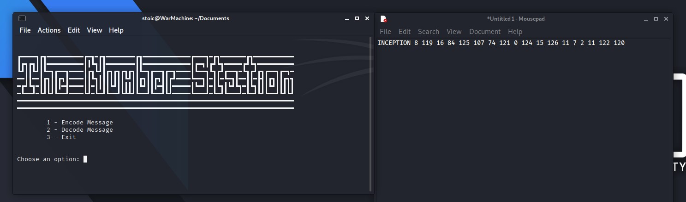

# theNumberStation

**theNumberStation** is a Python program that implements the [One-Time Pad](https://en.wikipedia.org/wiki/One-time_pad) concept described by [Gilbert Vernam](https://en.wikipedia.org/wiki/Gilbert_Vernam) and [Joseph Mauborgne](https://en.wikipedia.org/wiki/Joseph_Mauborgne). In theory, the cipher is unbreakable if the following rules are respected:

- The One-Time Pad should consist of random characters;
- The One-Time Pad should have the same length as the message;
- The One-Time Pad must be used only once per message;
- There must be only 2 copies of the One-Time Pad;
- The One-Time Pad must be destroyed immediately after use.

This program was made for fun, and was heavily inspired by the game "Call of Duty Black Ops" and number stations that operated during the Cold War. Since I cannot 100% prove or confirm that this particular implementation of the One-Time Pad Cipher is unbreakable, **I do not recommend that you encrypt real sensitive information using theNumberStation**. Yet, I personally believe it is fairly secure for not-so secret needs.


>"There are two kinds of cryptography in this world: cryptography that will stop your kid sister from reading your files, and cryptography that will stop major governments from reading your files."

*Bruce Schneier (1996) “Applied cryptography: protocols, algorithms, and source code in C”, John Wiley & Sons Inc*

>"The only truly secure system is one that is powered off, cast in a block of concrete and sealed in a lead-lined room with armed guards - and even then I have my doubts."

*Eugene Spafford in "Computer Recreations: Of Worms, Viruses and Core War" by A. K. Dewdney in Scientific American, March 1989, pp 110."*

I do believe theNumberStation can help you with the first kind problem Schneier mentioned. Have fun!

### Requirements

- Python 3.x

### Basic usage

Execute the code on a terminal with:

```bash
python3 theNumberStation.py
```


### References

- https://cryptomuseum.com/crypto/otp/index.htm
